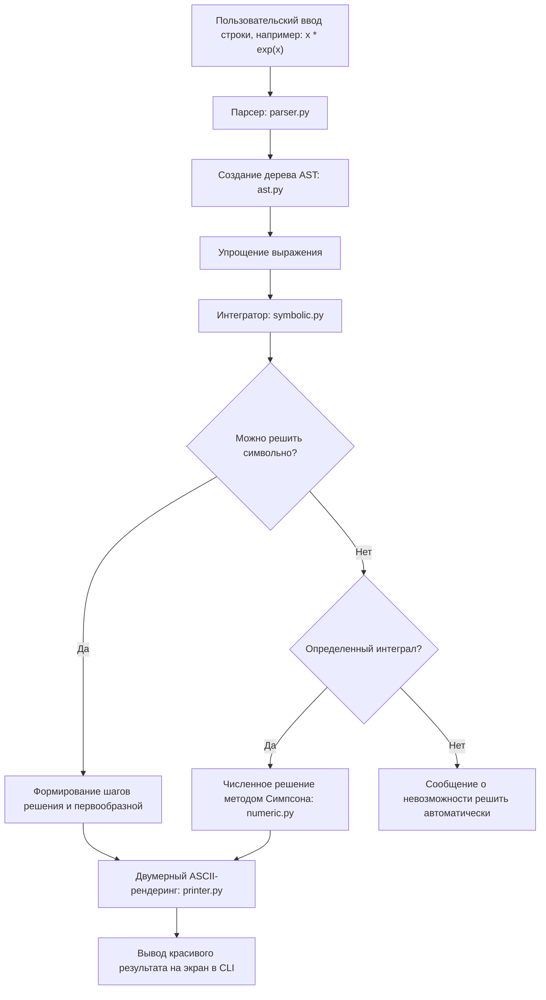

# 🧮 Integral Solver

**Integral Solver** — это мощный, автономный консольный инструмент для решения математических интегралов на языке Python. Программа умеет решать неопределенные, определенные, двойные и криволинейные интегралы, подробно описывая каждый шаг вычислений и выводя формулы в красивом двумерном (ASCII/Unicode) виде прямо в терминале.

> [!IMPORTANT]
> Проект написан **полностью на чистом Python** и **не требует установки сторонних математических библиотек** (таких как SymPy, NumPy, SciPy и др.). Все модули — от парсера выражений до символьного интегратора и графического отрисовщика — написаны с нуля!

---

## ✨ Ключевые возможности

*   **Интерактивный терминальный интерфейс:** Удобное меню, цветовое оформление, спиннеры во время вычислений.
*   **5 режимов интегрирования:**
    1.  **Неопределённый интеграл:** $\int f(x) \, dx$ с выводом пошагового нахождения первообразной.
    2.  **Определённый интеграл:** $\int_{a}^{b} f(x) \, dx$ с возможностью символьного расчета или численного приближения.
    3.  **Двойной интеграл:** $\iint f(x, y) \, dA$ по прямоугольной области.
    4.  **Криволинейный интеграл 1-го рода:** $\int_C f \, ds$ по заданной параметрически кривой.
    5.  **Криволинейный интеграл 2-го рода:** $\int_C P \, dx + Q \, dy$ по заданной параметрически кривой.
*   **Пошаговое объяснение решений:** Программа подробно расписывает, какие правила применила (вынесение константы, интегрирование суммы, интегрирование по частям, замена переменной, разложение на элементарные дроби).
*   **Двумерный ASCII-рендеринг:** Результаты интегрирования отображаются в виде красивых математических формул с многоэтажными дробями, квадратными корнями, степенями и знаками интегралов.
*   **Гибридный движок:** Если интеграл невозможно взять символьно (например, интеграл от функции $e^{-x^2}$), программа автоматически переключается на численный метод Симпсона для вычисления точного значения определенного интеграла.

---

## 🚀 Быстрый старт

### Требования
Для работы решателя требуется только установленный **Python 3.8** или более новой версии.

### Как запустить
Просто запустите главный файл [main.py]:

```bash
python3 main.py
```

## 🪟 Запуск на Windows
*   **Проблемы на винде:** нужно запускать под кодировкой UTF-8, потому что иначе будут постоянно ошибки при запуске:
    ```bash
    python3 -X utf8 main.py
    ```

---

## 📖 Инструкция по вводу формул

Вы можете вводить математические выражения в привычном для человека виде. Парсер умеет понимать опускаемые знаки умножения и альтернативные названия функций:

*   **Арифметические операции:** Сложение `+`, вычитание `-`, умножение `*` (или неявное `2x`), деление `/`, возведение в степень `^` (или `**`).
*   **Неявное умножение:** Можно писать `2x` вместо `2*x`, `x sin(x)` вместо `x*sin(x)`, `(x-1)(x+1)` вместо `(x-1)*(x+1)`.
*   **Математические константы:** `pi` (число $\pi$), `e` (основание экспоненты).
*   **Поддерживаемые функции:**
    *   Тригонометрия: `sin(x)`, `cos(x)`, `tan(x)` (или `tg(x)`), `cot(x)` (или `ctg(x)`).
    *   Обратные тригонометрические: `asin(x)`, `acos(x)`, `atan(x)`.
    *   Экспонента и логарифмы: `exp(x)`, `ln(x)` (или `log(x)`).
    *   Специальные: `sqrt(x)` (квадратный корень), `abs(x)` (модуль числа).

---

## 📂 Как устроен проект (Архитектура)

Код проекта разбит на логические модули, каждый из которых отвечает за свою часть математического или интерфейсного конвейера:

```
integral_solution/
│
├── main.py                          # Главный файл запуска (точка входа)
│
├── integral_solver/                 # Основной пакет приложения
│   ├── __init__.py                  # Инициализация пакета и экспорт API
│   │
│   ├── core/                        # Ядро математического парсинга и отображения
│   │   ├── ast.py                   # Представление формул в виде дерева (AST) и их упрощение
│   │   ├── parser.py                # Преобразование строки в дерево AST
│   │   └── printer.py               # Двумерный ASCII-рендеринг формул
│   │
│   ├── calculus/                    # Математические алгоритмы
│   │   ├── symbolic.py              # Символьное дифференцирование и интегрирование
│   │   ├── numeric.py               # Численное интегрирование (метод Симпсона)
│   │   ├── trig_utils.py            # Помощник для интегрирования тригонометрических степеней
│   │   └── solvers.py               # Координация шагов решения для 5 режимов
│   │
│   └── cli/                         # Интерфейс пользователя
│       └── main.py                  # Терминальный интерфейс, меню, цвета и анимация
│
└── tests/                           # Набор тестов
    └── test_integral_solver.py      # Модульные тесты для проверки корректности математики
```

### Подробное описание файлов:

1.  **Точка запуска:**
    *   [main.py](file:///home/wpng1337/integral_solution/main.py) — Импортирует и запускает интерактивную консоль.
    *   [integral_solver/__init__.py](file:///home/wpng1337/integral_solution/integral_solver/__init__.py) — Настраивает экспорт основных функций (`main`, `explain_solution`).

2.  **Модуль `core` (Ядро движка):**
    *   [ast.py](file:///home/wpng1337/integral_solution/integral_solver/core/ast.py) — Содержит описание математических узлов дерева (сложение, деление, синус, логарифм и т.д.). Здесь же сосредоточены правила **символьного упрощения выражений** (например, превращение `0*x` в `0`, `x/1` в `x`, `1*exp(x)` в `exp(x)`).
    *   [parser.py](file:///home/wpng1337/integral_solution/integral_solver/core/parser.py) — Отвечает за лексический и синтаксический анализ введенной строки и перевод её в дерево AST.
    *   [printer.py](file:///home/wpng1337/integral_solution/integral_solver/core/printer.py) — Превращает дерево AST в блок из строк и столбцов символов, чтобы в консоли красиво отображались горизонтальные дробные черты, степени наверху и скобки нужного размера.

3.  **Модуль `calculus` (Вычисления):**
    *   [symbolic.py](file:///home/wpng1337/integral_solution/integral_solver/calculus/symbolic.py) — Сердце программы. Реализует:
        *   Символьное дифференцирование (нужно для замен переменных и интегрирования по частям).
        *   Символьное интегрирование: от базовых формул ($\int x^n \, dx$, экспоненты, тригонометрия) до сложных алгоритмов — интегрирования по частям (для произведений многочленов на трансцендентные функции), линейной замены ($u = ax+b$), нелинейной $u$-подстановки, интегрирования рациональных дробей методом разложения.
    *   [trig_utils.py](file:///home/wpng1337/integral_solution/integral_solver/calculus/trig_utils.py) — Специализированные алгоритмы для вычисления интегралов вида $\int \sin^m(x) \cos^n(x) \, dx$ с использованием тригонометрических замен и понижения степени.
    *   [numeric.py](file:///home/wpng1337/integral_solution/integral_solver/calculus/numeric.py) — Реализует численный метод Симпсона (парабол) для определенных интегралов с динамическим шагом.
    *   [solvers.py](file:///home/wpng1337/integral_solution/integral_solver/calculus/solvers.py) — Собирает математические методы воедино для каждого из 5 типов задач, формирует историю шагов решения и возвращает структурированный ответ.

4.  **Модуль `cli` (Интерфейс):**
    *   [cli/main.py](file:///home/wpng1337/integral_solution/integral_solver/cli/main.py) — Управляет вводом пользователя, рисует рамки меню, раскрашивает вывод с помощью ANSI-последовательностей и организует пошаговое раскрытие математического решения.

---

## 🛠 Жизненный цикл вычисления интеграла

Давайте посмотрим, что происходит, когда вы вводите интеграл:



---

## 🧪 Запуск тестов

Вы можете убедиться в корректности работы всех алгоритмов интегрирования, запустив модульные тесты:

```bash
python -m unittest tests/test_integral_solver.py
```

Тестовый набор проверяет:
*   Интегрирование полиномов, логарифмов и тригонометрии.
*   Решение методом интегрирования по частям (`x*sin(x)`).
*   Решение сложных рациональных дробей с разложением знаменателя третьей степени.
*   Двойные и криволинейные интегралы 1-го и 2-го рода.
*   Автоматический переход на численный метод при отсутствии первообразной.